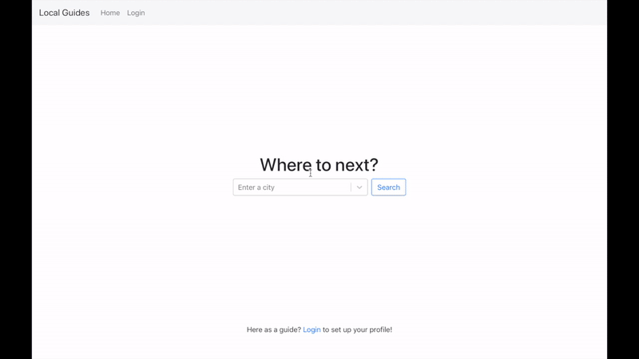

# Local Guides
Local Guides is platform for local tour guides to promote their services and for tourists to look for guides for their city trips. The purpose of starting this project is to practise full-stack development using MERN stack (MongoDB, ExpressJS, ReactJS, NodeJS).

## Sample App Preview

# User Stories
## Iteration 1 (Basic Functionality)
As a Guide:
- I can login to the app using my personal email address
- I can offer local tour services within cities for tourists
- I can decide the hourly rate for my services
- I can inform tourists about the list of languages I speak
- I can give an introduction to the tourists
- I can leave my contacts for the tourists to find me

As a Tourist:
- I can see a list of guides for a particular city
- I can compare hourly rates among different guides

## Iteration 2 (Incorporate Booking System)
As a Guide:
- I can have a personalised calendar showing a list of my available dates
- I can receive inbox regarding new bookings and messages
- I can post the picture associated with my account email

As a Tourist:
- I can book some of the dates from the guide’s personalised calendar
- I can leave a message to the guide about where to meet
- I can see a list of my bookings
